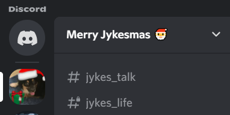
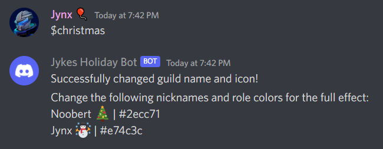

# Festive Discord Bot

## About

One of my Discord servers likes to change the server picture and server name for every holiday to get into the holiday spirit. This is tedious to perform for every holiday so I developed a bot to automate that process. For example, I just have to type the command `$christmas` to change the server name and picture to something Christmas-related.



Our server also likes to change all members' role colors and nicknames but unfortunately, the bot cannot automatically change these properties due to role hierarchies and permission issues. Instead, it will just send a message to the channel with the recommended role colors and member nicknames.



## Getting Started

Follow the instructions below to get a customized version of the bot up and running on your Discord server.

## Prerequisites

You must create a Discord bot that is configured with the appropriate settings and added to your server of choice. Refer to the [Discord Getting Started documentation](https://discord.com/developers/docs/getting-started) for guidance.

## Installation

Clone this repository:

```sh
$ git clone https://github.com/jasminjohal/festive-discord-bot.git
$ cd festive-discord-bot
```

Install the dependencies:

```sh
$ npm install
```

## Usage

### Creating a .env file

Create a new file with the extension `.env` in the same folder as the `index.js` file and name it `.env`.
Add the following two lines to the file. Make sure to replace both `{your_discord_key}` and `{your_discord_server_id}` with your Discord API key and the unique ID of your server, respectively.

```
DISCORD_TOKEN={your_discord_key}
DISCORD_GUILD={your_discord_server_id}
```

### Customizing the bot

Add your own images to the `img` folder or stick with the cute mini aussie pictures I have! Also, remember to change the `serverPicture` and `serverName` properties in the `holidays` object in the `holidays.js` file to whatever you see fit.

### Running the app

```sh
$ node index.js
```

The bot should now be online in your server. Happy holidays! 🎄
